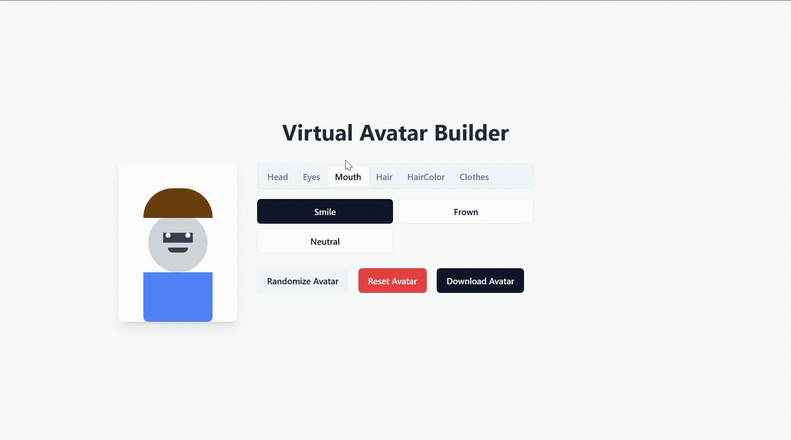

# Virtual Avatar Builder

Virtual Avatar Builder is a modern, interactive web app for building and customizing virtual avatars. You can mix and match head shapes, eyes, mouths, hair styles, hair colors, and clothing to create your own unique character. Built with React and TypeScript, this project highlights dynamic UI, component-based architecture, and responsive design.

## Demo



## Features

- **Customizable Avatars:** Choose head, eyes, mouth, hair style, hair color, and clothing.
- **Dynamic Hair Colors:** Select from multiple hair colors for all hair styles.
- **Clothing Options:** T-shirt (with Patagonia-style logo), hoodie, and suit (with lapels and shirt).
- **Interactive UI:** Real-time updates as you select features.
- **Responsive Design:** Looks great on desktop and mobile.
- **Download Avatar:** Export your creation as a PNG image.
- **Randomize & Reset:** Instantly randomize or reset your avatar.

## Tech Stack

- [React](https://reactjs.org/)
- [TypeScript](https://www.typescriptlang.org/)
- [Tailwind CSS](https://tailwindcss.com/)
- [html2canvas](https://html2canvas.hertzen.com/) (for image export)

## Getting Started

1. **Clone the repo:**
   ```bash
   git clone https://github.com/MJunhaoChen/virtual-avatar-builder.git
   cd virtual-avatar-builder
   ```
2. **Install dependencies:**
   ```bash
   npm install
   # or
   yarn install
   ```
3. **Run the app:**
   ```bash
   npm start
   # or
   yarn start
   ```
4. **Open in your browser:**
   Visit [http://localhost:8080](http://localhost:8080)

## Usage

- Select features using the tabs and buttons.
- Change hair color from the hair color tab.
- Click "Randomize Avatar" for a surprise look.
- Click "Reset Avatar" to go back to default.
- Click "Download Avatar" to save your creation as a PNG.
